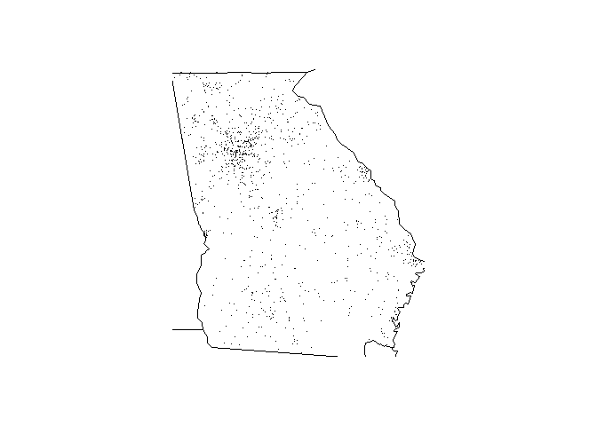

<!-- README.md is generated from README.Rmd. Please edit that file -->
farsReport
==========

The goal of farsReport is to allow easy reporting of standard formatted FARS accident reports.

The package contains data from the US National Highway Traffic Safety Administration's Fatality Analysis Reporting System, which is a nationwide census providing the American public yearly data regarding fatal injuries suffered in motor vehicle traffic crashes. The package allows easy reporting of FARS data sets from 2013, 2014 and 2015.

Installation
------------

You can install the released version of farsReport from [GitHub](https://github.com/bsleczko/farsReport) with:

``` r
devtools::install_github("https://github.com/bsleczko/farsReport")
```

Current status of build: [](https://travis-ci.org/bsleczko/farsReport)

FARS reporting
--------------

The `farsReport` package provides two functions for FARS reporting, the first is returning a tibble summarising the FARS for specified set of years, the second is plotting the FARS accidents on the map of the specified state, for specified `year`.

### FARS summary

The `fars_summarize_years(years)` function will summarize the FARS accidents per month and year, for given set of `years`.

``` r
library(farsReport)
farsReport::fars_summarize_years(years = c(2013, 2014))
#> # A tibble: 12 x 3
#>    MONTH `2013` `2014`
#>    <int>  <int>  <int>
#>  1     1   2230   2168
#>  2     2   1952   1893
#>  3     3   2356   2245
#>  4     4   2300   2308
#>  5     5   2532   2596
#>  6     6   2692   2583
#>  7     7   2660   2696
#>  8     8   2899   2800
#>  9     9   2741   2618
#> 10    10   2768   2831
#> 11    11   2615   2714
#> 12    12   2457   2604
```

### FARS mapplot per state

The `fars_map_state(state.num, year)` function will plot FARS accidents for specififed `year` on border map of the state (specified by `state.num` parameter). This function does not return any data, the side effect of the function is the plot of FARS accident on the border map of the state.

``` r
library(farsReport)
farsReport::fars_map_state(state.num = 13, year = 2014)
```


